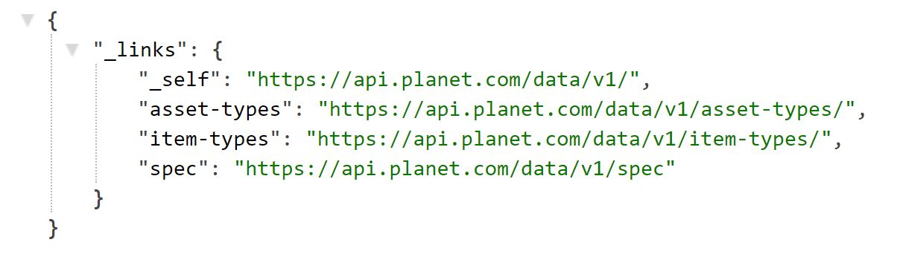

# Data API

Data API is the core API that you will deal with in this workshop. For the most part , the Data API allows you to search for Datasets, activate and download images. You can find entire [API reference here](https://developers.planet.com/docs/api/api-mechanics/) and we will access most of the functionality using the Planet Client. The API is self descriptive and allows you to read about specs, items and asset types.

You can exlore the data endpoint, by using this webaddress in chrome, use your API key as username and leave password blank

<center>
``` js
https://api.planet.com/data/v1/
```
</center>

<center></center>
