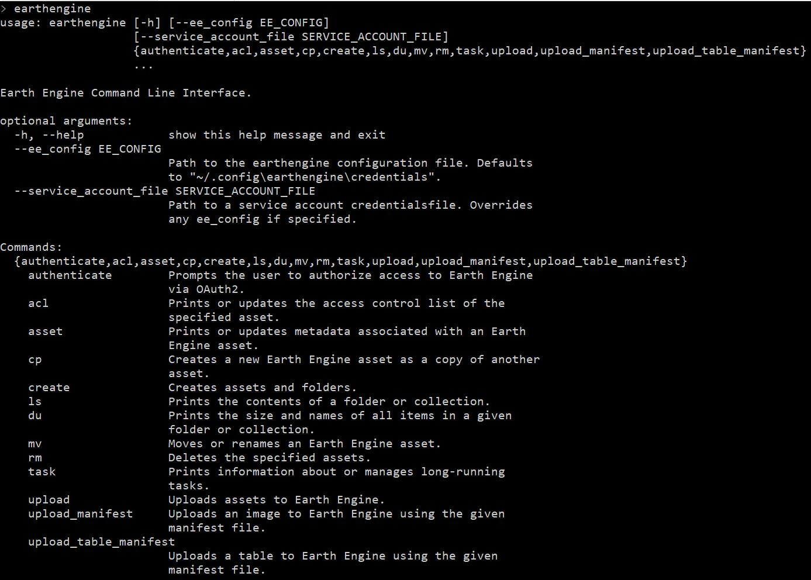
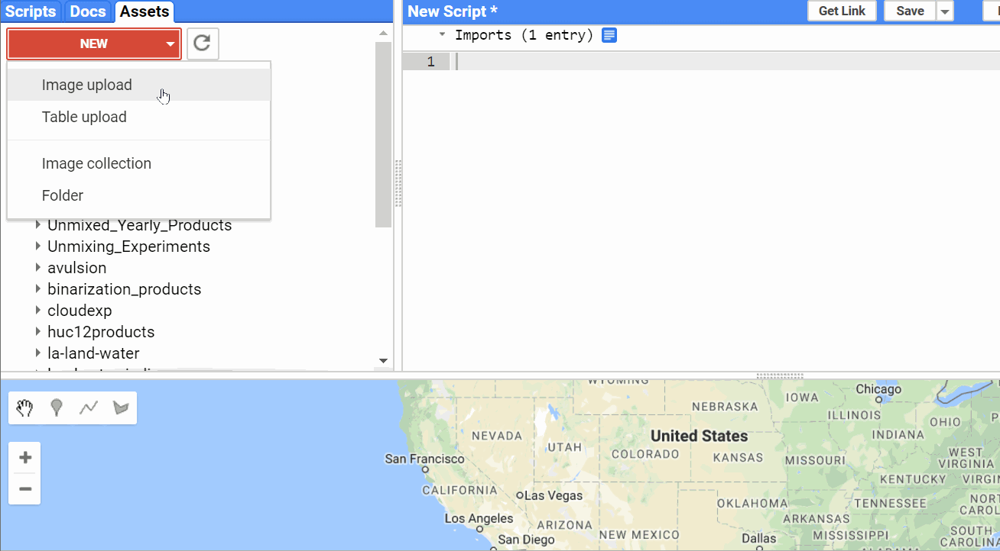

# Housekeeping and Setup

For most users data usage often boils down to the software you use to analyze and manipulate images and how you are going to work with them. So here are going to do some housekeeping and setup depending on which tools and setup you are most comfortable with

#### 1) Planet Command Line Interface(CLI) Setup
You planet account comes with a brand new CLI and it allows you to perfrom basic functions such as search for ID[s] and for images in a specific location, export all image footprint in your area of interest and so on. Installation is pretty simple

<center>```pip install planet```</center>

You installation steps from earlier means you have managed to not only create the Google Earth Engine account but also installed its client. Incase you have missed it go to their [main reference page for installation of their python client](https://developers.google.com/earth-engine/command_line).

<center></center>

#### 2) Google Earth Engine(GEE) Command Line Interface(CLI) Setup
This assumes that you have registered for a Google Earth Engine account but also installed its client. Incase you have missed it go to their [main reference page for installation of their python client](https://developers.google.com/earth-engine/command_line). Since you can consume Earth Engine using both Javascript(in browser) and Python(locally) the interaction would depend on the scale of your tasks and what you wish your achieve as your end result. Once installed make sure you authenticate your earth engine client and then your CLI should give you the following options

<center></center>

#### 3) Location to GEE datasets
For the purpose of this workshop, I have downloaded and ingested Planet 4Band Surface Reflectance imagery into an earth engine image colllection. The included data is maintained as open access license granted by the Open California Program. you can add any of the datasets by simply adding the following lines. For now you access these here

``` js
//Add image collection and area of interest
var collection=ee.ImageCollection('projects/sat-io/open-ca/ps4bsr')
var aoi=ee.FeatureCollection("projects/sat-io/open-ca/aoi")

//get size of collection
print("PlanetScope SR",collection.size())

//Get the first element from each collection
print("PSR Image",collection.first())
```

for those using python API you can still access a collection

``` py
import ee
ee.Initialize()
collection=ee.ImageCollection("projects/sat-io/open-ca/ps4bsr")

##Check how many images does the collection have
print(collection.size().getInfo())

## Print metadata from the first image
print(collection.first().getInfo())
```

#### 4) Adding additional Images
For a minute there imagine you want to work with more data apart from the few areas we talked about, the Education and Research account gives you 10,000 square kilometer and you can then upload it into GEE.

For the simplest users getting images into GEE begins with the Image upload tool located inside GEE. Once you have added the filename you can edit additional metadata such as start time, cloud cover information if you have that from the metadata file among other things. This tool does not have a way for you to ingest any metadata automatically so it has to be fed manually.

The image name is automatically filled in with the filename that you select when uploading.



Note you cannot select more than one image and upload as a single image if they overlap each other. To handle which we have the concept of image collections. Where you can upload many images. To import images into collections, you have to either import them manually as images first and then copy them into the collection one by one or for now use an external tool to help such as using the Google Earth Engine CLI.

For now you can use the tool I made to [batch upload collections along with their metadata into Google Earth Engine](https://github.com/samapriya/Planet-GEE-Pipeline-CLI). You can install this by simply typing

<center>```pip install ppipe```</center>

You can read about the tool, it's setup and it's operation at [this Planet Story](https://medium.com/planet-stories/planet-people-and-pixels-a-data-pipeline-to-link-planet-api-to-google-earth-engine-1166606445a8)

Incase you have a Google Cloud Storage bucket you can also push images automatically to be ingested into GEE. Though this requires interaction with gsutil and starting ingestion function for each image. The GEE guide for image ingestion can be [found here](https://developers.google.com/earth-engine/image_upload)

#### 5) Additional Tools and Toolboxes for Local Analysis
If you need to handle the data locally using Matlab, QGIS or ArcMap make sure you have these softwares installed. The images can then be downloaded and analyzed using multiple methods and toolsets. A lot of these softwares have additional capabilities to help you further use Planet data. You can find a better reference of external integration here

* [ENVI Integration](https://www.planet.com/pulse/explore-and-analyze-planet-imagery-with-harris-envi)
* [ESRI Integration](https://blogs.esri.com/esri/arcgis/2017/05/10/new-tools-for-managing-planet-imagery)
* [Cesium Integration](https://www.planet.com/pulse/planet-imagery-available-to-cesium-community)
* [Boundless](https://boundlessgeo.com/press_releases/boundless-announces-strategic-partnership-planet-expand-imagery-ecosystem)
* [PCI Geomatics](http://www.pcigeomatics.com/pressnews/2017_PCI_Planet_Ecosystem.pdf)
