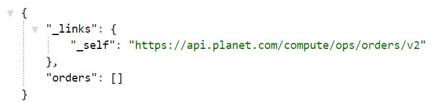

# Orders v2 API

[Ordersv2 is the next iteration of Planet's API](https://planet-platform.readme.io/docs) in getting Analysis Ready Data (ARD) delivered to you. Orders v2 allows you to improved functionality in this domain, including capability to submit an number of images in a batch order, and perform operations such as top of atmospheric reflectance, compression, coregistration and also enhanced notifications such as email and webhooks.You can find the [API overview and reference here](https://planet-platform.readme.io/docs/overview). This is not yet integrated into a client but you can make the requests using clients like Postman or ARC. The API unlike data API is not self descriptive and results will only appear once you have placed an order.

You can exlore the data endpoint, by using this webaddress in chrome, use your API key as username and leave password blank

<center>
``` js
https://api.planet.com/compute/ops/orders/v2
```
</center>

<center></center>

### **[Order Up: Using and Building with Planet ’s new Ordersv2 API](https://medium.com/@samapriyaroy/order-up-using-and-building-with-planet-s-new-ordersv2-api-ba2fe14eac8e)**
I did create a simple command line inteface (CLI) called porder to access this API and chain together tools, you can read about [the tool and the tutorial here](https://medium.com/@samapriyaroy/order-up-using-and-building-with-planet-s-new-ordersv2-api-ba2fe14eac8e). You can find it on [GitHub here](https://github.com/samapriya/porder).
