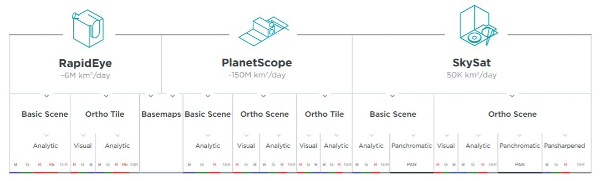

## **Understand Planet Items-Assets & API**

You can read the most updated white paper on planet products, items, assets and specifications [here](https://www.planet.com/products/satellite-imagery/files/Planet_Combined_Imagery_Product_Specs_December2017.pdf). While you look at these spec sheets try to understand how you would want to use the data, the purpose and scope of the question you want to answer, the size of downloads and the overall product or derivate in mind. To think of Planet products you have to understand two terms as thought they live in a hierarchy

<center></center>
<center>Planet Imagery Product Offerings</center>

#### Items and Assets

* Item type almost refers exclusively to a family of satellite or sensor types so PlanetScope, RapidEye, Skysat, Landsat and so on are all item types. These are model definitions based on the type of sensor you are utilizing for performing any type of analysis.

* Asset types are types of item derivatives or data types that you are actually utilizing for example analytic, analytic_sr, analytic_xml, visual and so on. These allow you to choose the type of actual data that you are able to download including the type and level of preprocesing that has been applied to it.

For further reference on item asset relationships you can [visit the docs](https://www.planet.com/docs/reference/data-api/items-assets/#item-type)

Now the assumption here is that after you have created your account you have downloaded data either from [Planet Explorer](https://www.planet.com/explorer) or you have been curious and looked into the data API and used the wonderful [python client](https://github.com/planetlabs/planet-client-python) from planet. Incase you have not and you have python on your system, invoke the power of pip and type

<center>```pip install planet```</center>

There is so much more to be done using planet data using some amazing API(s) including

* What if you wanted to download hundreds and thousands of scenes for your analysis, the [Data API](https://www.planet.com/docs/reference/data-api) will allow you to understand the backend.

* If you want your images to be automatically clipped to your area of interest, you can use the [Clips API](https://www.planet.com/docs/reference/clips-api)

