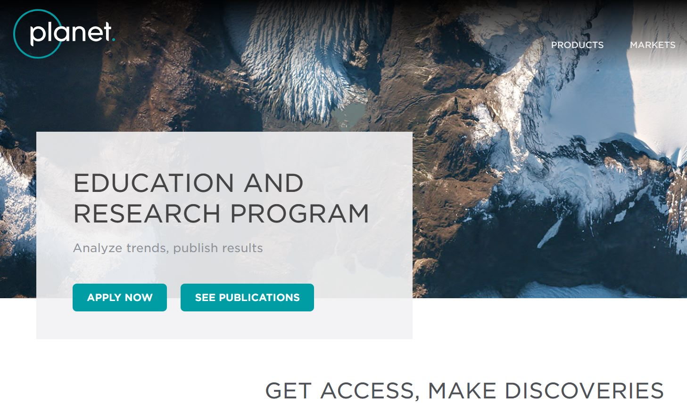
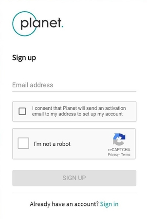

# Registering for a Planet account

What you need first to get started in simply to register for a Planet account. These account will almost immediately gain access to the Open California Dataset which is maintained regulary at this spatial and temporal resolution. You can find more information about the [Open California project here](https://www.planet.com/products/open-california/). These datasets and full-resolution imagery for the entire state of California are covered under a CC BY-SA 4.0 license via Planet's Open California initiative.

If you are a university researchers, academics, and/or  scientists, your free account allows you to download 10,000 square kilometers of data for non commercial use, every month, anywhere in the world. You can apply for [Education and Research account here](https://www.planet.com/markets/education-and-research/)

## Sign up for a Planet Account

[Planet Explorer](https://www.planet.com/products/explorer/) is a powerful tool for exploring Planet's catalog of daily imagery and worldwide mosaics
directly in your browser. It's also your gateway to creating a Planet Account,and gaining access to Planet's APIs.To sign up, visit [planet.com/explorer](https://www.planet.com/explorer/). From there, click **[Sign Up](https://www.planet.com/login/?mode=signup)** and enter your email address to receive an invitation:

Sign up with Planet Explorer

Check your email &amp; follow the directions to complete the registration process.

## Find your API Key
To use Planet's APIs, you'll need an API key. API keys are available to all registered users with active Planet accounts.Once you're signed up, log in to
[planet.com/account](https://www.planet.com/account/) to get your API key. Find the **API key** field under your account information, as seen here:

Account information (not a real API key)

# Registering for a Google Earth Engine Account
If you don’t have a developer account [sign up for one here](https://signup.earthengine.google.com/) and make sure you follow the [instructions](https://developers.google.com/earth-engine/python_install_manual) to install the python CLI.

The API and the CLI gets updated frequently and as does the install process as needed so you can read the latest instructions at the page.

#Getting Help with Planet and Google Earth Engine
Both Planet and Google Earth Engine maintain a developer page for you to find out more information,test tutorials along with housing a few quick FAQ(s)

You can find [Planet Developer Site here](https://developers.planet.com/)

and offcourse the [Earth Engine Developers Page](https://developers.google.com/earth-engine/)
