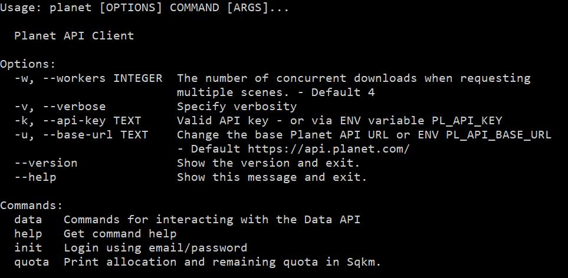
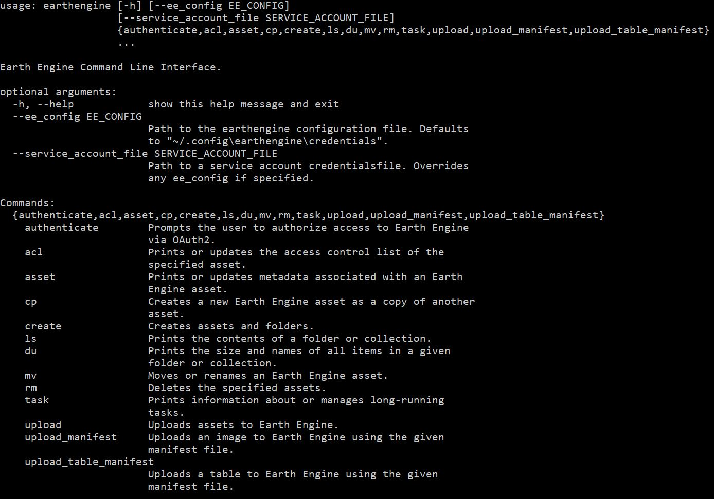
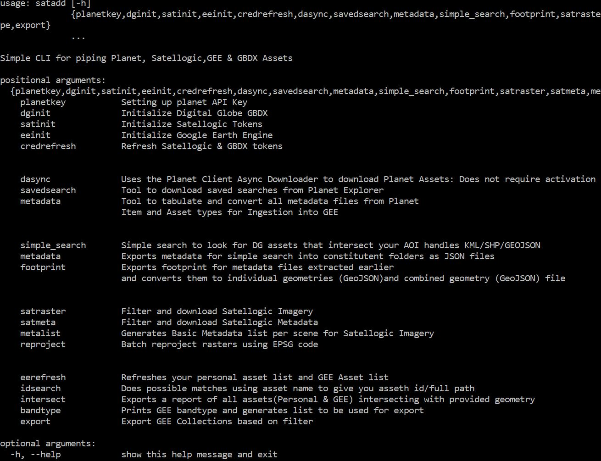

# Data Sources

### Earth Engine Data Catalog
The [Earth Engine Data Catalog](https://developers.google.com/earth-engine/datasets/) host over 500+ datasets that have been ingested and a lot more actively curated for easy use. The catalog allows you to look for datasets using keywords as tags so search for **water** and see what you can find.

### Open California Dataset
Apart from Education and Research account quota of 10,000 sqkm per month, you also have access to free and open data for all of California using the [Open California project](https://www.planet.com/products/open-california/)

### High Resolution Settlement Layer
The Connectivity Lab at Facebook released high resolution population datasets for a couple of countries these are done using high resolution training data at 0.5 m resolution and can be used to understand urban density and movement. This is a 3band product where based on information from [Center for International Earth Science Information Network(CIESIN)](https://ciesin.columbia.edu/data/hrsl/). I have ingested 13 High Resolution Settlement Layers(HRSL) layers into Google Earth Engine for you to use during the period of the hackathon.

You can find the dataset here
``` js
var hrsl=ee.ImageCollection('users/samapriya/hrsl')
print(hrsl)
```

### Microsoft: Computer generated building footprints for the United States and Open AI for Earth
In June Microsoft released 125 million Footprints in the US as Open Data,[US Buildings Footprints](https://github.com/Microsoft/USBuildingFootprints). Though considering the segmentation and classification are performed for Building rooftops as is a better indicator of rooftoop edges. That being said this was also when the discussion and interest in Microsoft Cognitive Toolkit [CNTK](https://github.com/Microsoft/CNTK). You can find more about the research including the papers and the resnet base on their [github page](https://github.com/Microsoft/USBuildingFootprints)

Another important and interesting project was the Land Cover Mapping using CNTK and the [GeoAI DataScience VM](https://docs.microsoft.com/en-us/azure/machine-learning/data-science-virtual-machine/geo-ai-dsvm-overview). Head to the [main website]

### Microsoft: AI for Earth
I am including the series of links and useful follow ups posted earlier on Slack to have easy reference

<center>

| **Azure Setup**                                                              | **Azure AI School**                                        | **Azure Congnitive Services**                                                                                  |**Azure VM Services**                                                                                                                     |
|------------------------------------------------------------------------------|------------------------------------------------------------|----------------------------------------------------------------------------------------------------------------|------------------------------------------------------------------------------------------------------------------------------------------|
|[Student Signup](https://azure.microsoft.com/en-us/free/students/)            |[Azure AI school](https://aischool.microsoft.com/en-us/home)|[Azure cognitive Services](https://docs.microsoft.com/en-us/azure/cognitive-services/)                          |[Azure Data Science VM](https://docs.microsoft.com/en-us/azure/machine-learning/data-science-virtual-machine/)                            |
|[Free Account Setup](https://azure.microsoft.com/en-us/free/)                 |[Azure AI Demo](https://aidemos.microsoft.com/)             |[Azure cognitive services demo](https://azure.microsoft.com/en-us/services/cognitive-services/directory/vision/)|[Azure Geo Data Science VM](https://docs.microsoft.com/en-us/azure/machine-learning/data-science-virtual-machine/geo-ai-dsvm-overview)    |
|[Azure Doc](https://docs.microsoft.com/en-us/azure/#pivot=products&panel=ai)  |[AI Lab](https://www.ailab.microsoft.com/)                  |                                                                                                                |[Azure Deep Learning VM](https://docs.microsoft.com/en-us/azure/machine-learning/data-science-virtual-machine/deep-learning-dsvm-overview)|
|[Azure SDK and Tools](https://docs.microsoft.com/en-us/azure/#pivot=sdkstools)|                                                            |                                                                                                                |                                                                                                                                          |

</center>

<center>

| <center>**Azure Machine Learning and AI**</center>                                                                                           		  	 |
|--------------------------------------------------------------------------------------------------------------------------------------------------------|
|[Azure Machine Learning Overview](https://docs.microsoft.com/en-us/azure/machine-learning/)                                                             |
|[Azure ML Sample Datasets](https://docs.microsoft.com/en-us/azure/machine-learning/studio/use-sample-datasets) |
|[Deep Learning and AI Frameworks](https://docs.microsoft.com/en-us/azure/machine-learning/data-science-virtual-machine/dsvm-deep-learning-ai-frameworks)|
|[Azure ML and data science Tools](https://docs.microsoft.com/en-us/azure/machine-learning/data-science-virtual-machine/dsvm-ml-data-science-tools)      |
|[Samples and Walkthroughs](https://docs.microsoft.com/en-us/azure/machine-learning/data-science-virtual-machine/dsvm-samples-and-walkthroughs)          |
|[Azure AI Gallery for community samples](https://gallery.azure.ai/)                                                                                     |

</center>

### Satellogic Open Data
Head over to [Satellogic's data explorer](https://telluric.satellogic.com/) and use the username and password provided to you during the hackathon to access their multispectral and hyperspectral datasets.

# Tools

### Planet CLI
The planet CLI as mentioned earlier allows you to batch activate, search, download imagery among other things interact with Planet Data API directly. You can [find it here](https://github.com/planetlabs/planet-client-python) or try ```pip install planet```

<center></center>

### Planet notebooks
Planet Labs holds and hosts [plenty of jupyter notebooks](https://github.com/planetlabs/notebooks) of you to be able to download, use and analyze Planet data.

### Earth Engine Python Installation
You can access earthengine using python rather than javascript for batch processing. Find [installation instructions here](https://developers.google.com/earth-engine/python_install)

### Earth Engine CLI
This is updated quite frequently [earthengine](https://developers.google.com/earth-engine/command_line) and new releases are [released on pypi](https://pypi.org/project/earthengine-api/)

<center></center>

### Satellogic Open Impact
Satellogic maintains an open impact repository that holds tutorials to access, download and process data along with introduction to Telluric for analysis. You can [find it here](https://github.com/satellogic/open-impact)

<center></center>

### [satadd: Satellite Data Download Addon](https://github.com/samapriya/satadd)
I wrote tool a few days back with the idea to harmonize easy access to data that are made available from public and private open data endpoints. This will allow you to download , Planet Labs data, Satellogic Data, query and search Digital Globe data , and query and download Earth Engine imagery as neeeded. You can [find the tool here](https://github.com/samapriya/satadd) or ```pip install satadd```

<center></center>
